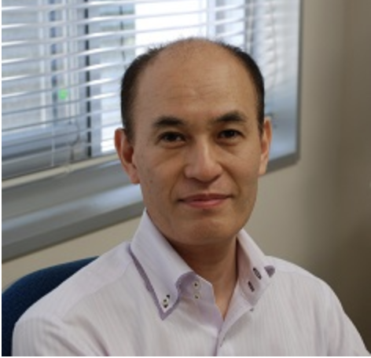

Youzou Miyadera was born on March 22, 1962. He received the B.Sc., M.Sc and D.Sc. degrees in engineering Science from Tokyo Denki University in 1984, 1986 and 1998, respectively.  
He was on the Department of Information Sciences at Tokyo Denki University as Instructor since April 1986 to March 1997.  
He was on the department of Mathematics and Information Science at Tokyo Gakugei University as associate professor until 2008.  
He is a professor of the division of Natural Science at Tokyo Gakugei University now.  
His current research interests include information visualization, programming language educational systems, program analysis and drawing algorithms.  
He is a member of IEEE Computer Society, ACM, the Information Processing Society of Japan, the Institute of Electronics, Information and Communication Engineers, Japan Society for Information and Systems in Education, and the Japan Society for Software Science and Technology.  
He has a teste for Scuba Diving.  

1962年3月22日生まれ．  
東京電機大学工学部にて，1984年に学士，1986年に修士，1998年に博士をそれぞれ授与．  
1986年4月から，1997年3月まで東京電機大学情報科学科の講師を勤める．  
また，2008年まで東京学芸大学の数学科・情報科学科の准教授として勤め，現在同大学の自然科学部門における教授として在籍中．  
情報視覚化，プログラミング言語教育システム，プログラム解析，描画アルゴリズムなどの研究に従事している．  
IEEEコンピュータ学会，ACM，情報処理学会，電子情報通信学会，日本情報教育学会，日本ソフトウェア科学会の一員．  
スキューバダイビングで余生を楽しむ予定である．  

* [研究業績](https://gyoseki.u-gakugei.ac.jp/search/detail.html?systemId=4bcbb413e3725da9520e17560c007669&lang=ja)
* [Research Achievements](https://gyoseki.u-gakugei.ac.jp/search/detail.html?systemId=4bcbb413e3725da9520e17560c007669&lang=en)

# Contact

Youzou Miyadera  
Department of Mathematics and Information Science,  
Tokyo Gakugei University  
4-1-1, Nukui-Kita, Koganei, Tokyo, 184-0015, Japan.  
Phone/Fax +81-423-29-7475  
Email miyadera@u-gakugei.ac.jp  
